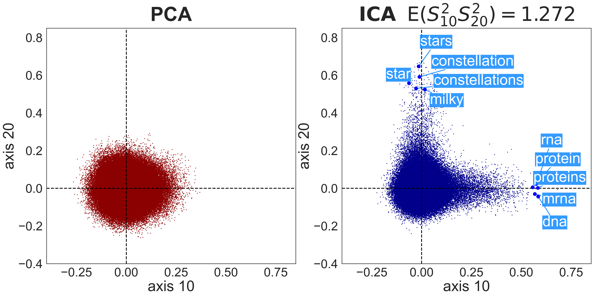
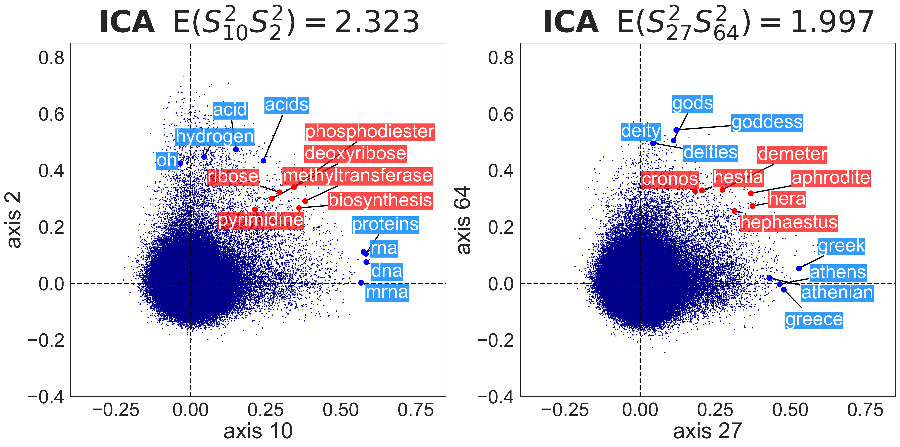
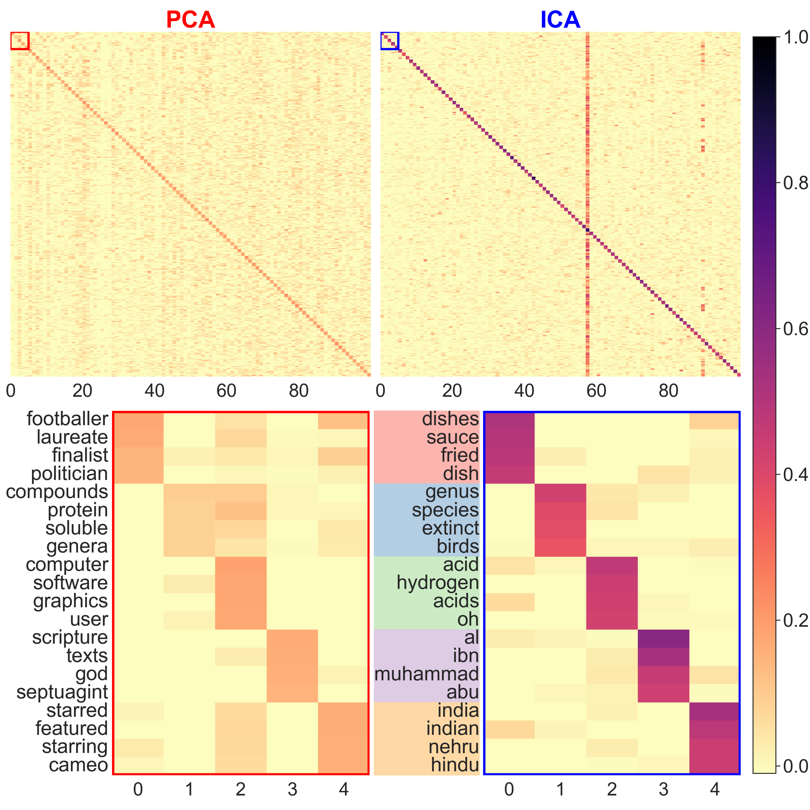
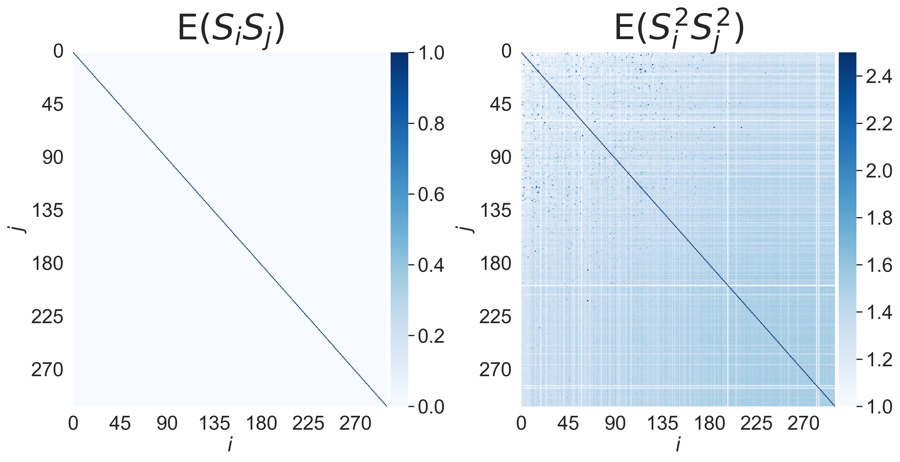
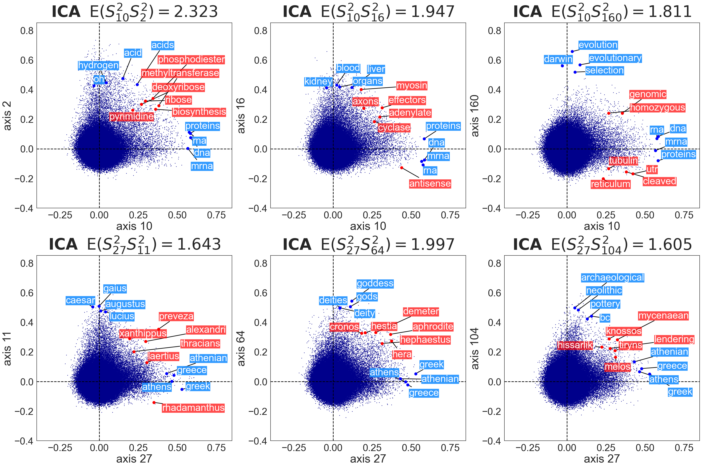
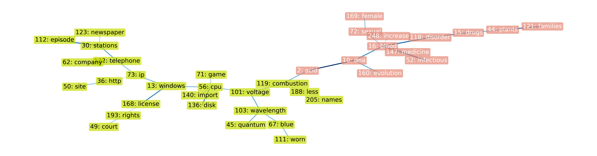
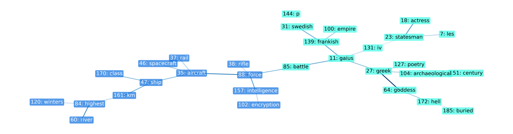
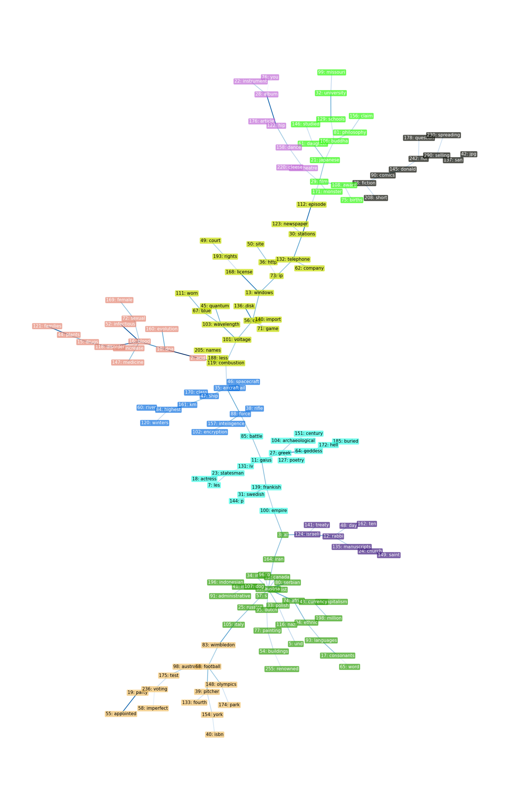

# Understanding Higher-Order Correlations Among Semantic Components in Embeddings (EMNLP 2024)

To further interpret the results of Independent Component Analysis (ICA) on word embeddings [1, 2], we focus on the non-independencies among the estimated independent components. By quantifying these non-independencies using higher-order correlations, we offer new insights into the semantic structure of embeddings. Our analysis reveals significant associations between components with high higher-order correlations, which we visualize through maximum spanning trees, enhancing our understanding of embedding structures.

<p align="center">
  
  
</p>

## 🔑 Key Insights

- Independent Components in Word embeddings are not fully independent
- Quantified non-independence using Higher-Order Correlations
- Components with high Higher-Order Correlations are semantically related
- Visualized non-independence structure using maximum spanning trees

**This repository contains the code to reproduce the experimental results presented in our EMNLP 2024 paper: [Understanding Higher-Order Correlations Among Semantic Components in Embeddings](https://arxiv.org/abs/2409.19919).**

## 🛠️ Setup & Data

### Setup
1. Clone the repository:
   ```
   git clone https://github.com/momoseoyama/hoc.git
   ```
2. Create and activate a virtual environment (Python 3.10):
   ```
   python3.10 -m venv venv
   source venv/bin/activate  # On Unix or MacOS
   # or
   venv\Scripts\activate  # On Windows
   ```
3. Install required packages:
   ```
   pip install -r requirements.txt
   ```

### Data
Download required datasets from our [Google Drive folder](https://drive.google.com/drive/folders/1DCRptlI6z1QDY1b4WEyVL209kfZ8QLfx?usp=drive_link):

1. `pca2_20240103_203056.pkl` → `data/ica_data/`
2. `text8_sgns-Win_ep100` → `data/text8_sgns/`

## 🔬 Reproducing Results

### Figure 1: PCA vs ICA Transformed Embeddings
```bash
python fig1_heatmap-pca-ica.py
```


ICA reveals sparser, more interpretable semantic components compared to PCA.

### Figure 2: Word Embeddings Along PCA/ICA Axes
```bash
python fig2_scatter-pca-ica.py
```


ICA uncovers interpretable semantic axes (e.g., "biology", "stars") that PCA misses.

### Figure 3: Higher-Order Correlations
```bash
python fig3_heatmap-corr-hoc.py
```


Estimated independent components show varying degrees of higher-order correlations.

### Figure 4 & 10: Additive Compositionality Examples
```bash
python fig4_scatter-high-hoc.py
```




Words with large component values in both axes reflect meanings of both, demonstrating additive compositionality.

### Figure 5 & 12: MST Visualization of Higher-Order Correlations
```bash
python fig5_mst-subtrees.py
```





Maximum Spanning Tree (MST) reveals semantic relationships and groupings among components.

### Table 2: Semantic Relevance Evaluation (GPT-4o mini)
```bash
bash table2_reproduction.sh
python table2_gpt-evaluation.py display --embedding ICA --dims 100 --model gpt-4o-mini --save_dir ./table2_reproduction
python table2_gpt-evaluation.py display --embedding ICA --dims 100 --model gpt-4o-mini --save_dir ./table2_paper_results
```
Note: Requires OpenAI API key (`export OPENAI_API_KEY='your-api-key-here'`)

## 📚 Citation

```BibTeX
@inproceedings{oyama2024understanding,
    author = {Momose Oyama and Hiroaki Yamagiwa and Hidetoshi Shimodaira},
    title = {Understanding Higher-Order Correlations Among Semantic Components in Embeddings},
    booktitle = {Proceedings of the 2024 Conference on Empirical Methods in Natural Language Processing, {EMNLP}},
    year = {2024}
}
```

## 📖　References

[1] Tomáš Musil, David Mareček. "Exploring Interpretability of Independent Components of Word
Embeddings with Automated Word Intruder Test". LREC-COLING 2024.

[2] Hiroaki Yamagiwa, Momose Oyama, Hidetoshi Shimodaira. "Discovering Universal Geometry in Embeddings with ICA". EMNLP 2023.